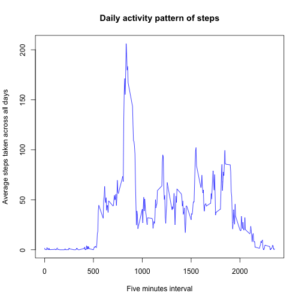
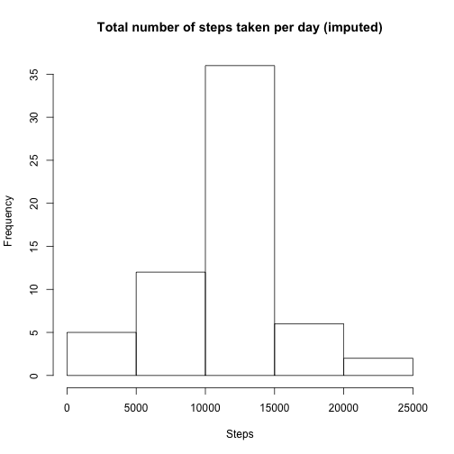

------
*title: "Peer-graded Assignment: Course Project 1, of the Course Reproducible Research"*
author: "Javier Eslava Schmalbach"
date: "5/5/2018"
output: html_document
------

#[Instructions taken from the course]("https://www.coursera.org/learn/reproducible-research/peer/gYyPt/course-project-1")

##Introduction

"It is now possible to collect a large amount of data about personal movement using activity monitoring devices such as a Fitbit, Nike Fuelband, or Jawbone Up. These type of devices are part of the “quantified self” movement – a group of enthusiasts who take measurements about themselves regularly to improve their health, to find patterns in their behavior, or because they are tech geeks. But these data remain under-utilized both because the raw data are hard to obtain and there is a lack of statistical methods and software for processing and interpreting the data".

"This assignment makes use of data from a personal activity monitoring device. This device collects data at 5 minute intervals through out the day. The data consists of two months of data from an anonymous individual collected during the months of October and November, 2012 and include the number of steps taken in 5 minute intervals each day".

"The data for this assignment can be downloaded from the course web site:

Dataset: [Activity monitoring data [52K]]("https://d396qusza40orc.cloudfront.net/repdata%2Fdata%2Factivity.zip")

##The specific instructions to follow are: 

        ### 1. Load the data (i.e. 𝚛𝚎𝚊𝚍.𝚌𝚜𝚟())


```r
library(data.table)
library(plyr)
library(dplyr)
library(lubridate)

        activity <- read.csv("./activity.csv", header = TRUE)
```

        ### 2. Process/transform the data (if necessary) into a format suitable for your analysis


```r
        str(activity)
```

```
## 'data.frame':	17568 obs. of  3 variables:
##  $ steps   : int  NA NA NA NA NA NA NA NA NA NA ...
##  $ date    : Factor w/ 61 levels "2012-10-01","2012-10-02",..: 1 1 1 1 1 1 1 1 1 1 ...
##  $ interval: int  0 5 10 15 20 25 30 35 40 45 ...
```

```r
        activity$date <- as.POSIXct(strptime(activity$date, "%Y-%m-%d"))
```

## What is mean total number of steps taken per day?

"For this part of the assignment, you can ignore the missing values in the dataset".

This is the function to ignore missings


```r
        activity <- activity[ with (activity, { !(is.na(steps)) } ), ]
```

        ### 1. Calculate the total number of steps taken per day

```r
        daily <- group_by(activity, date)
        steps.daily <- summarise(daily, total = sum(steps))
        steps.daily
```

```
## # A tibble: 53 x 2
##    date                total
##    <dttm>              <int>
##  1 2012-10-02 00:00:00   126
##  2 2012-10-03 00:00:00 11352
##  3 2012-10-04 00:00:00 12116
##  4 2012-10-05 00:00:00 13294
##  5 2012-10-06 00:00:00 15420
##  6 2012-10-07 00:00:00 11015
##  7 2012-10-09 00:00:00 12811
##  8 2012-10-10 00:00:00  9900
##  9 2012-10-11 00:00:00 10304
## 10 2012-10-12 00:00:00 17382
## # ... with 43 more rows
```

        ### 2. Make a histogram of the total number of steps taken each day


```r
        hist(steps.daily$total, main = "Total number of steps taken per day", xlab = "Steps" )
```


        ### 3. Calculate and report the mean and median of the total number of steps taken per day

```r
        mean_steps <- mean(steps.daily$total)
        median_steps <- median(steps.daily$total)
```

*Answers*: 
The mean of total number of steps taken per day is 1.0766189 &times; 10<sup>4</sup>
The median of total number of steps taken per day is 10765

## What is the average daily activity pattern?

        ### 1. Make a time series plot (i.e. 𝚝𝚢𝚙𝚎 = "𝚕") of the 5-minute interval (x-axis) and the average number of steps taken, averaged across all days (y-axis)


```r
        interval <- group_by(activity, interval)
        steps.interval <- summarise(interval, mean = mean(steps))
        steps.interval
```

```
## # A tibble: 288 x 2
##    interval   mean
##       <int>  <dbl>
##  1        0 1.72  
##  2        5 0.340 
##  3       10 0.132 
##  4       15 0.151 
##  5       20 0.0755
##  6       25 2.09  
##  7       30 0.528 
##  8       35 0.868 
##  9       40 0.    
## 10       45 1.47  
## # ... with 278 more rows
```

```r
        plot(steps.interval$interval, steps.interval$mean, type = "l", xlab = "Five minutes interval", ylab = "Average steps taken across all days", main = "Daily activity pattern of steps", col = "blue")
```




        ### 2. Which 5-minute interval, on average across all the days in the dataset, contains the maximum number of steps?


```r
        max.interval <- which.max(steps.interval$mean)
        steps.interval1 <- steps.interval[max.interval,]
```

*Answer*: On average across all the days in the dataset, the interval and mean of that interval with the maximun number of steps are  835, 206.1698113, respectively


##Imputing missing values

        ### Note that there are a number of days/intervals where there are missing values (coded as 𝙽𝙰). The presence of missing days may introduce bias into some calculations or summaries of the data.

        ### 1. Calculate and report the total number of missing values in the dataset (i.e. the total number of rows with 𝙽𝙰s)


```r
activity <- read.csv("./activity.csv", header = TRUE)
activity$date <- as.POSIXct(strptime(activity$date, "%Y-%m-%d"))

ok <- complete.cases(activity)
not_ok <- sum(!ok)
not_ok
```

```
## [1] 2304
```

*Answer*: The total number of missing values in the dataset is  2304


        ### 2. Devise a strategy for filling in all of the missing values in the dataset. The strategy does not need to be sophisticated. For example, you could use the mean/median for that day, or the mean for that 5-minute interval, etc.

To execute this commands, I used a function (impute.mean taken from answer 38 at stackoverflow)[https://stackoverflow.com/questions/9322773/how-to-replace-na-with-mean-by-subset-in-r-impute-with-plyr]. I used the mean of steps for the 5-minutes interval


```r
 before <- sum(is.na(activity))

        library(data.table)
        setDT(activity)

        impute.mean <- function(x) replace(x, is.na(x), mean(x, na.rm = TRUE))

        
        activity$steps <- as.double(activity$steps)
        activity$steps <- as.matrix(activity[, steps := as.double(impute.mean(steps)), by = interval])
```

```
## Warning in `[<-.data.table`(x, j = name, value = value): 3 column matrix
## RHS of := will be treated as one vector
```

```
## Warning in `[<-.data.table`(x, j = name, value = value): Supplied 52704
## items to be assigned to 17568 items of column 'steps' (35136 unused)
```

```
## Warning in `[<-.data.table`(x, j = name, value = value): NAs introduced by
## coercion
```

```
## Warning in `[<-.data.table`(x, j = name, value = value): Coerced
## 'character' RHS to 'double' to match the column's type. Either change the
## target column to 'character' first (by creating a new 'character' vector
## length 17568 (nrows of entire table) and assign that; i.e. 'replace'
## column), or coerce RHS to 'double' (e.g. 1L, NA_[real|integer]_, as.*, etc)
## to make your intent clear and for speed. Or, set the column type correctly
## up front when you create the table and stick to it, please.
```

```r
 after <- sum(is.na(activity))
```

*Comment*: Even though, the command generated some warnings, this was executed correctly, as it can be seen counting NA's, respectively,  before 2304 and after 0 using the command. 

        ### 3.Create a new dataset that is equal to the original dataset but with the missing data filled in. 

The new database is like the original because missings were imputed directley on it. However, I changed it from data.frame to data.table


```r
        activity1 <- data.table(activity)
```


        ### 4. Make a histogram of the total number of steps taken each day and Calculate and report the mean and median total number of steps taken per day. Do these values differ from the estimates from the first part of the assignment? What is the impact of imputing missing data on the estimates of the total daily number of steps?


```r
        daily1 <- group_by(activity1, date)
        steps.daily1 <- summarise(daily1, total = sum(steps))
        steps.daily1
```

```
## # A tibble: 61 x 2
##    date                 total
##    <dttm>               <dbl>
##  1 2012-10-01 00:00:00 10766.
##  2 2012-10-02 00:00:00   126.
##  3 2012-10-03 00:00:00 11352.
##  4 2012-10-04 00:00:00 12116.
##  5 2012-10-05 00:00:00 13294.
##  6 2012-10-06 00:00:00 15420.
##  7 2012-10-07 00:00:00 11015.
##  8 2012-10-08 00:00:00 10766.
##  9 2012-10-09 00:00:00 12811.
## 10 2012-10-10 00:00:00  9900.
## # ... with 51 more rows
```

```r
        hist(steps.daily1$total, main = "Total number of steps taken per day (imputed)", xlab = "Steps")   
```




```r
mean1 <- mean(steps.daily1$total)

median1 <- median(steps.daily1$total)
```


*Answer*: As it can be seen, there are not differences with the previous values, as in the histogram as in the mean  1.0766189 &times; 10<sup>4</sup> and median values  1.0766189 &times; 10<sup>4</sup>. 

## Are there differences in activity patterns between weekdays and weekends?

        ## For this part the 𝚠𝚎𝚎𝚔𝚍𝚊𝚢𝚜() function may be of some help here. Use the dataset with the filled-in missing values for this part.

        ### 1. Create a new factor variable in the dataset with two levels – “weekday” and “weekend” indicating whether a given date is a weekday or weekend day.


```r
        library(lubridate)
        activity1$weekday <- weekdays(as.Date(activity1$date))
        
        activity1$weekday <- as.character(ifelse(activity1$weekday %in% c("Saturday", "Sunday"), "weekend", "weekday"))
```

Now, I will check if the factor variable was well-created. 


```r
 table(activity1$weekday)
```

```
## 
## weekday weekend 
##   12960    4608
```
*Comment*: It is OK

        ### 2. Make a panel plot containing a time series plot (i.e. 𝚝𝚢𝚙𝚎 = "𝚕") of the 5-minute interval (x-axis) and the average number of steps taken, averaged across all weekday days or weekend days (y-axis). 

Fist of all, I have to aggregate steps values, according to intervals, and estimate the avaerage values at weekdays and weekends. After this, I make the panel plot


```r
        weekday <- aggregate(steps ~ interval + weekday, data = activity1, mean)
        
library(lattice)
        par(mfrow = c(1,1), mar = c(4,2,2,1))
       xyplot(steps ~ interval | weekday, data = weekday, type = "l", main = "Steps across weekends and weekdays") 
```


*Comment*: Maximum values are on weekdays. However averages values of steps for different intervals are higher on weekends. 


